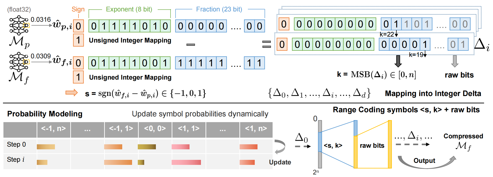

# FM-Delta: Lossless Compression for Storing Massive Fine-tuned Foundation Models



## Introduction
We found that most fine-tuned models in cloud have a small difference (delta) from their pre-trained models. To this end, we propose a novel lossless compression scheme FM-Delta specifically for storing massive fine-tuned models in cloud.

## Installation

```
# pull git repo
git clone https://github.com/ningwanyi/FM-Delta.git #url
cd FM-Delta
pip install -r requirements.txt

# install fmd package
cython -3 --fast-fail -v --cplus ./fmd.pyx
python setup.py install

# check if installing successfully
python test.py  
```

For `fmd` package, we provide the main functions and their arguments:

- `fmd.compress(base_model, finetuned_model, save_path=None)`

  - `--base_model`: The pre-trained model in a model pair.
  
  - `--finetuned_model`: The fine-tuned model in a model pair.
  
  - `--save_path`: (Optional) The path where the compressed model chunks will be saved. If not provided, the chunks will not be saved to disk.


- `fmd.compress_param(base_data, finetuned_data, order='C')`

  - `--base_data`: A numpy array representing the parameters of the pre-trained model.

  - `--finetuned_data`: A numpy array representing the parameters of the fine-tuned model.

  - `--order`: (Optional) Specifies the memory layout ('C' for row-major or 'F' for column-major). Defaults to 'C'.

- `fmd.decompress(compressed_finetuned_model, base_model, save_path=None)`

  - `--compressed_finetuned_model`: The dictionary containing the compressed finetuned model, where the key is the layer name and the value is the compressed layer bytes.

  - `--base_model`: The pre-trained model used for reconstructing the finetuned model.
  - `--save_path`: (Optional) The path where the compressed model chunks are saved. 

- `fmd.decompress_param(bytes encoded, base_data, order='C')`

  - `--encoded`: The compressed bytes of the finetuned model parameter.

  - `--base_data`: A numpy array of the pre-trained model's parameters.

## Run
```
ARG="--base_model bert-large-uncased \
  --finetuned_model Jorgeutd/bert-large-uncased-finetuned-ner \
  --dtype fp32 \
  --compressor fmd"

python examples/main.py $(echo ${ARGS})
```

## Citation
```
@article{ning2024fmdelta,
  title={FM-Delta: Lossless Compression for Storing Massive Fine-tuned Foundation Models},
  author={Wanyi Ning, Jingyu Wang, Qi Qi, Mengde Zhu, Haifeng Sun, Daixuan Cheng, Jianxin Liao, Ce Zhang},
  journal={NeurIPS 2024},
  year={2024}
}
```

## Acknowledgement
We borrowed a part of the open-source code of [fpzip](https://github.com/LLNL/fpzip). The used quasi-static modeler is from [http://www.compressconsult.com/rangecoder/](http://www.compressconsult.com/rangecoder/). Many thanks for their wonderful works.